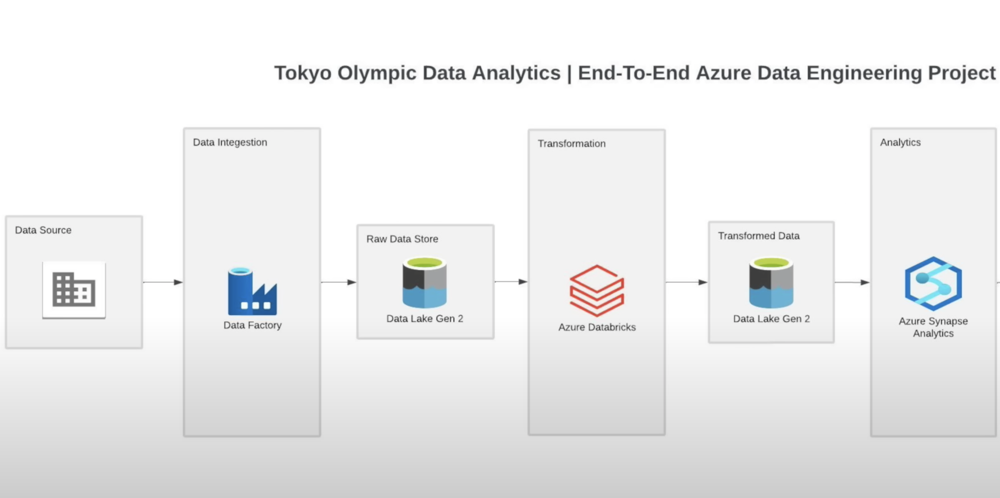

# Olympic Data Microsoft Azure Data Engineering Project by Simon Abraham

## Overview

The goal of this project is to securely handle, simplify, and evaluate structured and semi-structured data from the Tokyo Olympics and trending indicators.

## Project Goals
1. Data Ingestion — Build a pipeline system to source and extract data from an online location.
2. ETL — Transform the data from the raw source format into a proper DataFrame.
3. Data lake — Storing the raw and transformed data into a centralized repoistory.
4. Analytics and Reporting - Using the transformed data to run Analytical SQL queries and Visualize the data.

##Tools and Services Used
This project was primarily done using Microsoft Azure services.

1. Github: The csv format of the data was used uploaded on to github and the data was sourced from that location
2. Azure Data Factory: For ingesting the data
3. Azure Data Bricks: For trandformation of the ingested data
3. Azure Data Gen Lake 2: For storing the raw and extracted data
4. Azure Synapse Analytics: For running analysis and visualization

## Dataset used
https://www.kaggle.com/datasets/arjunprasadsarkhel/2021-olympics-in-tokyo

## Architecture Diagram

