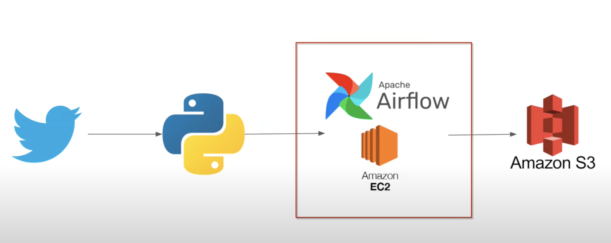

# Twitter API Airflow Amazon Web Services Data Engineering Project by Simon Abraham

## Important:
Please watch the video of entire workflow for this project for better understanding here: https://drive.google.com/file/d/1qvBbjJBhQriguPMiaWeci2crcVc_wPKP/view?usp=sharing

## Overview
This project aims to securely streamline data obtained from Twitter and convert it into a structured format through Directed Acyclic Graph DAG

## Project Goals
1. Data Ingestion — Sourcing the data from Twitter API developer portal
2. ETL — Using python to extract the data from twitter api and changing it into a DataFrame.
3. Using a DAG to build a pipeline to systematically extract, Transform and Load the data.
4. Data storage — Storing the transformed data into an data bucket.

## Tools and tech used
Programming Language - Python

Twitter API developer portal - To get the tweets as raw data
Amazon EC2 - To use a virtual machine to connect to Apache Airflow
Apache Airflow - To create and Directed Acylic Graph pipeline to streamline the ETL process.
Amazon S3 - To store the data into storage buckets

## Architecture Diagram

